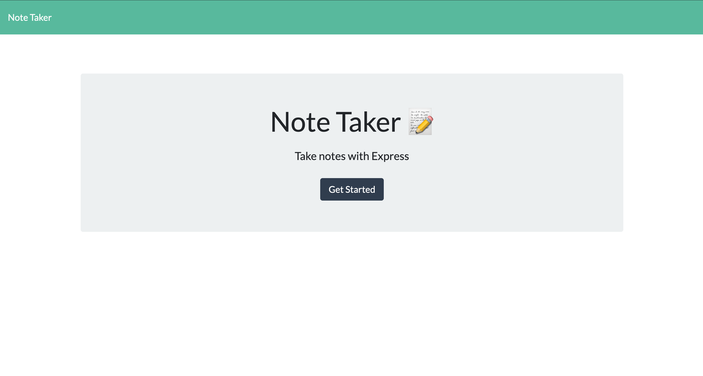

# Note Taker Starter Code
A website lets you take notes by using express.js.
## Image of the main page 

## Usage of the webpage

## Content
** Express.js,
** npm
## Deployed Application Link 
[[!Link](https://powerful-woodland-88287.herokuapp.com/)]
